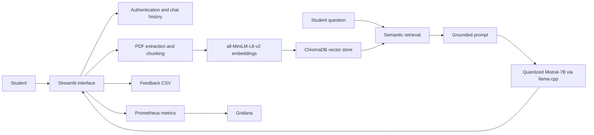

# QuizCatalyst

### A local-first, retrieval-augmented learning assistant for grounded educational support

[](https://www.python.org/)
[](https://streamlit.io/)
[](#system-design)
[](#project-status)

QuizCatalyst explores how a compact, locally hosted language model can support learning from student-provided course material. Students can upload a PDF, ask questions grounded in that document, generate revision material, retain chat history, and provide response-level feedback.

The repository brings the application, retrieval pipeline, lightweight fine-tuning workflow, data-risk controls, and observability stack into one reproducible research prototype.

> [!IMPORTANT]
> QuizCatalyst is an experimental educational system, not an authoritative source or a replacement for an instructor. Generated answers should be checked against the original material.

## Research contribution

QuizCatalyst is intended as a practical reference implementation for studying:

- private, local inference with a quantized 7B-parameter model;
- document-grounded tutoring with retrieval-augmented generation (RAG);
- lightweight educational adaptation using QLoRA and instruction data;
- feedback signals for qualitative evaluation of generative tutors;
- preprocessing controls for toxicity, personally identifiable information, bias review, and dataset provenance; and
- operational monitoring of generation, retrieval, ingestion, and user-feedback behavior.

Rather than presenting a new foundation model, the contribution is the integration of these components into an inspectable end-to-end educational AI system.

## System design



The application offers two modes:

| Mode | Behavior |
|---|---|
| **LLM** | Conversational generation without document retrieval |
| **RAG + LLM** | Retrieves relevant PDF chunks and supplies them as context to the model |

## Features

- Account creation, login, and persistent chat history
- PDF text extraction and overlapping recursive chunking
- Local Sentence-Transformer embeddings and persistent ChromaDB search
- Local GGUF inference through `llama-cpp-python`
- Automatic chat titles and study-guide generation
- Per-response thumbs-up/down feedback with optional comments
- Prometheus metrics for latency, response length, retrieval, ingestion, and feedback
- Docker Compose services for the application, Prometheus, and Grafana
- QLoRA fine-tuning workflow based on a sampled Dolly instruction dataset
- Data preparation utilities for provenance logging, toxicity filtering, PII redaction, and descriptive bias auditing

## Repository structure

```text
QuizCatalyst_Submission/
├── src/
│   ├── main.py                  # Streamlit application and orchestration
│   ├── config.py                # Model, storage, and retrieval configuration
│   ├── models/                  # LLM, embedding code, and LoRA adapter
│   ├── rag/                     # PDF processing, vector storage, and retrieval
│   ├── training/                # Dataset preparation and QLoRA training
│   ├── utils/                   # Authentication, persistence, feedback, metrics
│   └── data/                    # Local uploads and persistent Chroma data
├── risk_management/             # Data safety and provenance utilities
├── monitoring/prometheus/       # Prometheus scrape configuration
├── deployment/Dockerfile        # CUDA-enabled application image
├── docker-compose.yml           # App, Prometheus, and Grafana services
└── documentation/               # Research and system-design report
```

## Getting started

### Prerequisites

- Docker with Docker Compose
- An NVIDIA GPU, compatible driver, and NVIDIA Container Toolkit
- A compatible Mistral-7B GGUF model file
- Approximately 8–16 GB of available GPU memory, depending on quantization and context size

The base GGUF weights are not included in this repository. Obtain them from a source whose license permits your intended use, rename the file to `mistral-7b.gguf`, and place it at:

```text
src/models/mistral-7b.gguf
```

### Run the complete stack

```bash
git clone https://github.com/ajit1203/QuizCatalyst_AIS.git
cd QuizCatalyst_AIS
docker compose up --build
```

After startup, open:

- QuizCatalyst: <http://localhost:8501>
- Prometheus: <http://localhost:9090>
- Grafana: <http://localhost:3000>

The development Grafana credentials configured in `docker-compose.yml` are `admin` / `admin`. Change them before exposing the service to any network.

### First use

1. Create a local account and sign in.
2. Start a new chat.
3. Select **RAG + LLM** mode.
4. Upload a text-based PDF.
5. Ask questions or generate a study guide.
6. Rate responses to record qualitative feedback.

Scanned or handwritten PDFs require OCR before upload.

## Model and retrieval configuration

Runtime defaults are defined in [`src/config.py`](src/config.py):

| Setting | Default |
|---|---:|
| Base model | Mistral-7B-compatible GGUF |
| Context window | 4,096 tokens |
| Embedding model | `sentence-transformers/all-MiniLM-L6-v2` |
| Chunk size | 1,000 characters |
| Chunk overlap | 200 characters |
| Retrieved chunks | 3 |
| Maximum generated tokens | 1,024 |
| Temperature | 0.7 |
| Chroma distance | Cosine |

## Fine-tuning and data governance

The included adapter was trained from `mistralai/Mistral-7B-Instruct-v0.2` with rank-16 LoRA adapters targeting the query and value projection layers. The preprocessing workflow samples Databricks Dolly 15k and applies the following stages:

```text
Dolly sample
   → provenance record
   → toxicity filtering
   → PII redaction
   → chat-template formatting
   → descriptive bias audit
   → QLoRA supervised fine-tuning
```

Relevant entry points:

- [`src/training/process_data.py`](src/training/process_data.py) — dataset preparation
- [`src/training/finetune.py`](src/training/finetune.py) — QLoRA training
- [`risk_management/`](risk_management/) — provenance and risk controls
- [`src/models/quizcatalyst-dolly-adapter/`](src/models/quizcatalyst-dolly-adapter/) — trained adapter artifact

The Dolly dataset is distributed under **CC BY-SA 3.0**. Base-model, embedding-model, and third-party dataset licenses remain independently applicable.

## Evaluation

The prototype currently supports instrumentation rather than a completed benchmark suite. Available signals include:

- end-to-end generation latency;
- retrieval latency and cosine distance distribution;
- retrieval attempts and non-empty context hits;
- response length;
- ingestion success and failure counts; and
- explicit positive/negative user feedback.

For research comparisons, report model and quantization details, hardware, prompt configuration, retrieval parameters, corpus composition, and a fixed question set. Groundedness, answer correctness, retrieval recall, latency percentiles, and human-rated pedagogical usefulness should be evaluated separately.

## Responsible use and privacy

- Do not upload confidential, regulated, or personally identifying material to a shared deployment.
- The current prototype stores accounts, chats, feedback, uploaded files, and vector data locally without application-level encryption.
- Generated content may contain hallucinations, omissions, or biased language.
- Data preprocessing controls reduce risk but do not prove that a dataset or model is safe or unbiased.
- Public deployments should add strong password hashing, per-user storage isolation, encrypted transport, access controls, retention policies, and security review.

See the full [AI Systems Project Proposal](documentation/AI%20System%20project%20proposal/AI%20Systems%20Project%20Proposal.pdf) for the broader research rationale and design record.

## Project status

QuizCatalyst is a research prototype. The core application and observability paths are implemented, while production hardening, automated evaluation, tests, source attribution in generated answers, and strict multi-user document isolation remain future work.

## Contributing

Research and engineering contributions are welcome. Useful contribution areas include:

- groundedness and retrieval benchmarks;
- document-level and user-level vector-store isolation;
- citations linking answers to retrieved passages;
- automated tests and reproducible evaluation datasets;
- accessible interaction design;
- prompt-injection and adversarial-document defenses; and
- model cards, dataset cards, and privacy documentation.

Before opening a pull request, keep changes focused, document experimental assumptions, and include evidence for behavioral or performance claims. Please avoid committing model weights, user data, generated databases, or uploaded documents.

## Citation

If this repository supports your research or coursework, please cite it as:

```bibtex
@software{lingannagaru2025quizcatalyst,
  author  = {Lingannagaru, Ajit Reddy},
  title   = {QuizCatalyst: A Retrieval-Augmented Personalized Learning Assistant},
  year    = {2025},
  url     = {https://github.com/ajit1203/QuizCatalyst_AIS}
}
```

## License

No software license file is currently included. Until one is added, copyright remains with the repository author and reuse may be restricted. Contributors and downstream users should also review the licenses of Mistral, Sentence Transformers, Dolly, and all other dependencies and artifacts.

---

Developed by **Ajit Reddy Lingannagaru** as an applied AI systems research project.
